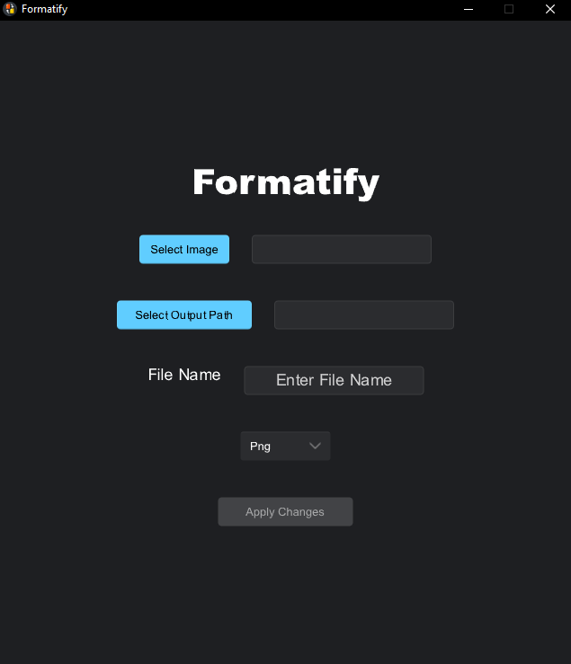

# Formatify

Formatify is a desktop application that allows users to change image file formats while preserving image quality. The app leverages Rust for its powerful backend capabilities and Slint for its user-friendly graphical interface.

## Features

- **Convert Image Formats**: Change images to your preferred format without compromising quality.
- **Convert Multiple Images**: Change images to your preferred format at once.
- **Image Formats Supported**: Png, WebP, Bmp ,Jpeg .

## Technologies Used

- **Backend**: Rust
- **Frontend**: Slint

## Dependencies

This project uses the following dependencies:

```toml
[dependencies]
image = "0.25.5"
rayon = "1.10.0"
rfd = "0.15.1"
slint = "1.9.1"

[build-dependencies]
slint-build = "1.9.1"
winresource = "0.1.19"
```

## How to Run

1. Clone the repository:

```bash
git clone https://github.com/YOUA/Formatify
```

2. Navigate to the project directory:

```bash
cd Formatify
```

3. Build the project:
```bash
cargo build
```

4. Run the application:
```bash
cargo run
```

## Testing the Executable

To test the compiled executable application:

1. Build the project in release mode:
```bash
cargo build --release
```

2. Navigate to the target/release directory:
```bash
cd target/release
```

3. Run the executable file:
```bash
Formatify.exe
```

## Screenshots

### Format Conversion Interface



## Contributing

This project is currently maintained by a single developer and is not open for external contributions. However, feel free to explore the code, use it for learning, and share feedback or suggestions by opening an issue.

## License

This project is licensed under the CC0 1.0 License. See the LICENSE file for details.
