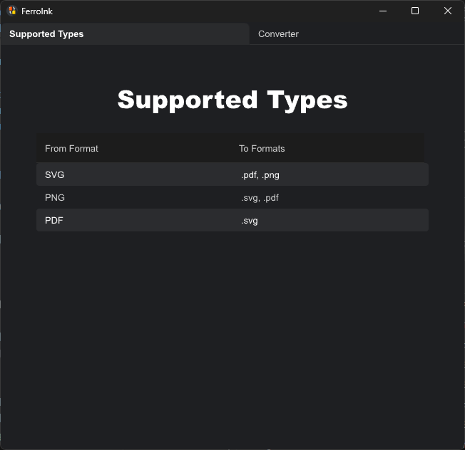
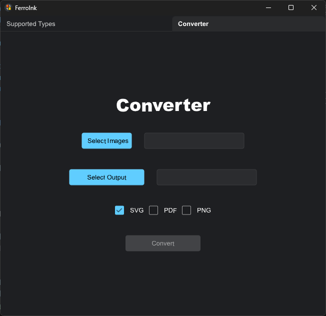

# FerroInk

FerroInk is a desktop application that allows users to change image file formats while preserving image quality. The app leverages Rust for its powerful backend capabilities and Slint for its user-friendly graphical interface.

## Features

- **Convert Image Formats**: Change images to your preferred format without compromising quality.
- **Convert Multiple Images**: Change images to your preferred format at once.
- **Supported Types**: 
```bash
| From |     To     |
|------|------------|
| SVG  | .pdf, .png |
| PNG  | .svg, .pdf |
| PDF  |    .svg    |
```
## Technologies Used

- **Backend**: Rust
- **Frontend**: Slint

## Dependencies

This project uses the following dependencies:

```toml
[dependencies]
rayon = "1.10.0"
rfd = "0.15.2"
slint = "1.9.1"

[build-dependencies]
slint-build = "1.9.1"
winresource = "0.1.19"
```

## How to Run

1. Clone the repository:

```bash
git clone https://github.com/Silen1t/FerroInk
```

2. Navigate to the project directory:

```bash
cd FerroInk
```

3. Build the project:
```bash
cargo build
```

4. Run the application:
```bash
cargo run
```

## Testing the Executable

To test the compiled executable application:

1. Build the project in release mode:
```bash
cargo build --release
```

2. Navigate to the target/release directory:
```bash
cd target/release
```

3. Run the executable file:
```bash
FerroInk.exe
```

## Screenshots

### Interfaces




## Contributing
This project is currently maintained by a single developer and is not open for external contributions. However, you are welcome to:

Explore the code and use it for learning purposes.

Share feedback, suggestions, or report issues by opening a [GitHub issue](https://github.com/Silen1t/FerroInk/issues).

Thank you for your understanding and support!

## License

This project is licensed under the Creative Commons Zero v1.0 Universal (CC0 1.0) license.
You can copy, modify, distribute, and perform the work, even for commercial purposes, all without asking permission.
For more details visit [Creative Commons](https://creativecommons.org/publicdomain/zero/1.0/).